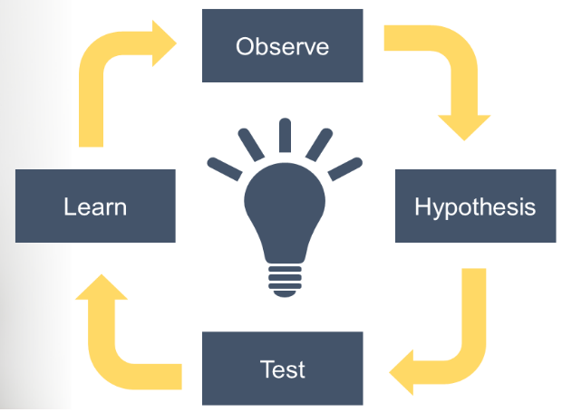

# **My ideas Journal**

This website is a space for jotting down ideas and thoughts. The ideas ,ay turn in to plausible project and further may generate a hypothesis under the wide umbrella of topics in neuroscience.

### Thoughts to Hypothesis

